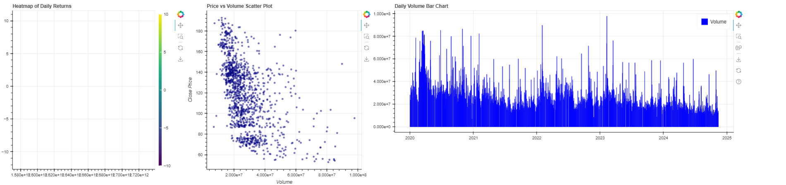

<br>



# Stock Market Financial Dashboard

This is a Project that I created in my free time. I made a simple financial dashboard using Python and the Bokeh Python library. The dashboard can display the stock prices of a company over time using Yahoo Finance Python Package, and the user can also add Indicators to help them make better investment decisions. The indicators include 100 Day SMA, 30 Day SMA, Linear Regression Line, 50 Day EMA, RSI, MACD, Bollinger Bands.

## Features:

- **Real-Time Stock Data**: Fetch and display the latest stock prices and market data for various stocks.

- **Historical Data Visualization**: View historical stock prices with interactive charts to analyze trends over time.

- **Stock Comparison**: Compare multiple stocks side-by-side to evaluate performance metrics.

- **Technical Indicators**: Calculate and visualize common technical indicators (e.g., moving averages, RSI) to assist in trading decisions.

- **More Visualization Tools**: Added more visualization tools such as heatmaps, scatter plots, and bar charts to provide a more comprehensive view of the Stocks.

- **Responsive Design**: Access the dashboard from various devices with a user-friendly interface.

- **Data Export**: Export portfolio data and charts in a PNG Format for offline analysis.

## Installation

To download this Repository
You can download the zip file or Clone the Project Repository using Git with the below command:

```bash
git clone https://github.com/DhruvAthaide/StockMarketFinancialDashboard.git
```


Move the Command Line to the Project Directory:

```bash
cd '.\StockMarketFinancialDashboard\'
```

Then Run the following commands to install the Script Requirements:

```bash
pip install -r requirements.txt
```

Then you can go ahead and run the Dashboard using the command:

```bash
bokeh serve --show main.py
```

## Authors

- [@DhruvAthaide](https://github.com/DhruvAthaide)

## Languages & Tools Used:

<p align="left">

<a href="https://www.python.org/" target="_blank" rel="noreferrer"> 
             </a>
</p>

## Future Work:
- **Machine Learning Integration**: Integrate machine learning models to predict stock prices and provide buy/sell recommendations
- **Real-time Data**: Update the dashboard to display real-time stock data
- **Customization**: Allow users to customize the dashboard layout and add/remove widgets as per their preference
- **Alert System**: Integrate an alert system to notify users of significant price movements or other important events.
- **Data Visualization**: Enhance data visualization to provide a better understanding of the stock market trends and patterns.
- **Add more features**: Add more features such as sentiment analysis, news analysis, and technical analysis to provide a more comprehensive view of the stock market.
- **Improve user experience**: Improve the user experience by making the dashboard more user-friendly and intuitive.
- **Add more data sources**: Add more data sources such as historical data, economic indicators, and company-specific data to provide a more comprehensive view of the stock market.
- **Improve data quality of data**: Improve the quality of data by cleaning, processing, and transforming it to make it more accurate and reliable.