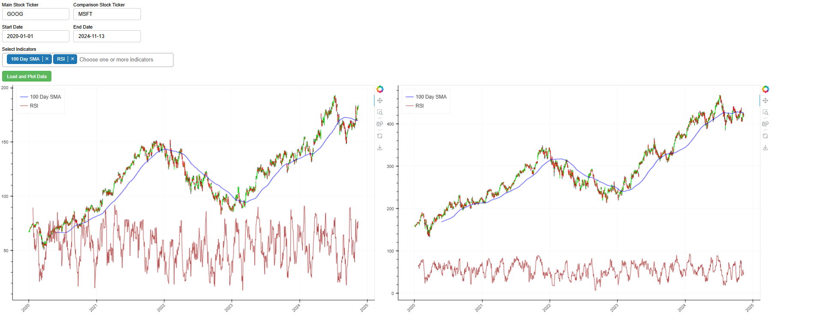

# Stock Financial Dashboard

This is a Project that I created in my free time. I made a simple financial dashboard using Python and the Brokeh library. The dashboard is designed to display the current stock prices and you can also compare two different stocks.

## Installation

To download this Repository
You can download the zip file or Clone the Project Repository using Git with the below command:

```bash
git clone https://github.com/DhruvAthaide/StockFinancialDashboard.git
```

Then open Command Prompt, in the Project Directory and proceed further with whichever Installation you want to go ahead with:

# Stock Predictor - LSTM Model Installation

To Install the Requirements for this Script:

Move the Command Line to the Project Directory:

```bash
cd '.\StockFinancialDashboard\'
```

Then Run the following commands to install the Script Requirements:

```bash
pip install -r requirements.txt
```

Then you can go ahead and run the Dashboard using the command:

```bash
bokeh serve --show main.py
```

## Authors

- [@DhruvAthaide](https://github.com/DhruvAthaide)

## Languages & Tools Used:

<p align="left">

<a href="https://www.python.org/" target="_blank" rel="noreferrer"> 
             </a>
</p>
